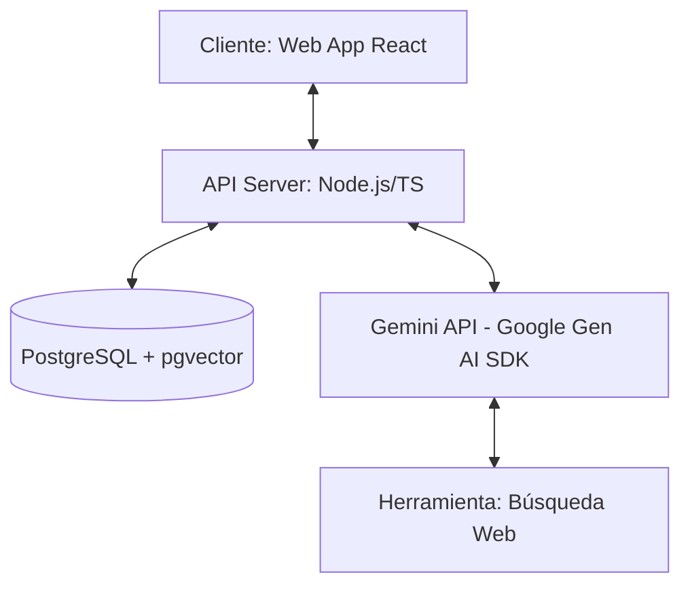

# Especificación Detallada: Agente Alura 🤖📚

Este documento presenta la especificación funcional, la arquitectura del sistema y la pila tecnológica recomendada para el desarrollo del **Agente Alura**, un asistente de IA conversacional y cognitivo diseñado para potenciar la experiencia de aprendizaje de los estudiantes en la plataforma Alura.

---

## 1. Descripción General del Producto

El **Agente Alura** es un compañero inteligente de estudio integrado directamente en la experiencia de la plataforma de Alura. Su propósito es reducir la tasa de abandono de los cursos, resolver dudas técnicas de programación en tiempo real, recomendar trayectorias de aprendizaje personalizadas y dinamizar el estudio mediante interacciones gamificadas.

---

## 2. Capacidades y Requerimientos Funcionales Detallados

### 2.1. Tutoría de Programación y Feedback de Código (Modo Tutor)
El agente no solo debe dar la respuesta a un problema de código, sino actuar como un tutor socrático que guía al estudiante hacia la solución.
- **Explicación Conceptual**: Desglosar conceptos complejos (ej. *closures* en JavaScript, *inyección de dependencias* en Spring Boot, *análisis de datos* en Pandas) usando analogías sencillas y adaptadas al nivel actual del alumno.
- **Evaluación de Código**: El estudiante puede pegar su código y pedir revisión. El agente analizará:
  - Corrección sintáctica y lógica.
  - Buenas prácticas (limpieza, legibilidad).
  - Rendimiento básico.
- **Generador de Retos**: Proponer pequeños desafíos interactivos que complementen las lecciones del curso activo del estudiante.

### 2.2. Recomendación Inteligente de Rutas de Aprendizaje
El agente debe actuar como un orientador profesional continuo dentro de Alura.
- **Análisis de Perfil**: Leer el historial de cursos finalizados del estudiante, las tecnologías con las que ha interactuado y sus objetivos profesionales autodeclarados (ej. "Quiero ser desarrollador Backend Java").
- **Descubrimiento de Cursos**: Sugerir el siguiente curso, podcast de Alura, o especialización, justificando el porqué de la recomendación basándose en las brechas de habilidades del estudiante.

### 2.3. Búsqueda y Resolución de Consultas Académicas (RAG)
Para evitar respuestas incorrectas o alucinaciones sobre el contenido de los cursos:
- **Búsqueda Semántica**: Implementar un sistema de Generación Aumentada por Recuperación (RAG) conectado a una base de datos vectorial que contenga:
  - Transcripciones de los videos de los cursos de Alura.
  - Artículos y tutoriales oficiales de Alura.
  - Preguntas y respuestas frecuentes del foro de la comunidad.
- **Citas y Referencias**: El agente debe incluir enlaces o referencias a las clases específicas del curso de donde extrajo la información técnica.

### 2.4. Integración y Automatización mediante Function Calling (Herramientas del Agente)
El agente podrá interactuar con el entorno mediante llamadas a funciones (*Function Calling*):
- **Búsqueda en la Web (Google Search)**: Para complementar su conocimiento con documentación oficial actualizada (MDN Web Docs, StackOverflow, documentación de Python, etc.).
- **Simulador/Validador de Código**: Invocar un entorno seguro para verificar salidas de código si el estudiante necesita comprobar el resultado de una sintaxis específica.

---

## 3. Arquitectura del Sistema Recomendada

La arquitectura sigue el patrón de un sistema Agente-Servicio moderno desacoplado en tres capas principales:

### 3.1. Capa de Presentación (Frontend)
- **Tecnología**: **React + Vite (TypeScript)**.
- **Estilado**: **Vanilla CSS** con diseño responsive premium, temas de contraste (modo oscuro/claro con gradientes HSL estilizados) y micro-animaciones en los componentes de chat (indicadores de escritura, transiciones fluidas de mensajes).
- **Características**: Ventana de chat persistente, renderizado de Markdown (con bloques de código coloreados y soporte de copy-paste), y panel de progreso de aprendizaje interactivo.

### 3.2. Capa de Negocio y Orquestación (Backend)
- **Tecnología**: **Node.js (TypeScript)** utilizando un framework rápido como **Express** o **Fastify**.
- **Motor del Agente**: Implementado usando el **SDK de Google Gen AI (`@google/genai`)**, aprovechando Gemini 2.0 / 1.5.
- **Manejo de Contexto**: Módulo de gestión de memoria conversacional (almacenamiento del historial de chat a corto y mediano plazo).

### 3.3. Capa de Datos e Indexación (Base de Datos)
- **Tecnología**: **PostgreSQL** habilitado con **`pgvector`** para búsquedas vectoriales eficientes.
- **Estructura**:
  - `users`: Perfil de alumnos, progreso de aprendizaje y preferencias.
  - `chats`: Historial persistente de conversaciones con metadatos de sesión.
  - `embeddings`: Fragmentos vectorizados de las transcripciones de cursos y artículos de Alura para el motor RAG.

---

## 4. Flujo de Interacción del Agente

El flujo del agente para resolver una duda de programación sigue estos pasos:

1. **Entrada del Alumno**: El alumno envía una consulta ("¿Cómo hago una petición fetch en React?").
2. **Clasificación de Intención**: El backend clasifica la intención (¿es una pregunta de código, de plataforma, o requiere RAG?).
3. **Recuperación RAG**: Si es académica, se realiza una búsqueda semántica de embeddings en PostgreSQL para extraer el contenido relevante del curso de React de Alura.
4. **Llamada al LLM con Contexto**: Se envía el prompt al modelo Gemini con el historial de chat, la duda del alumno, los documentos recuperados y las herramientas de búsqueda disponibles.
5. **Decisión del Modelo**: El modelo decide si responde directamente o si invoca una herramienta (ej. Google Search para verificar la documentación más reciente).
6. **Respuesta Estructurada**: Se envía la respuesta al Frontend en formato Markdown amigable con el alumno.
