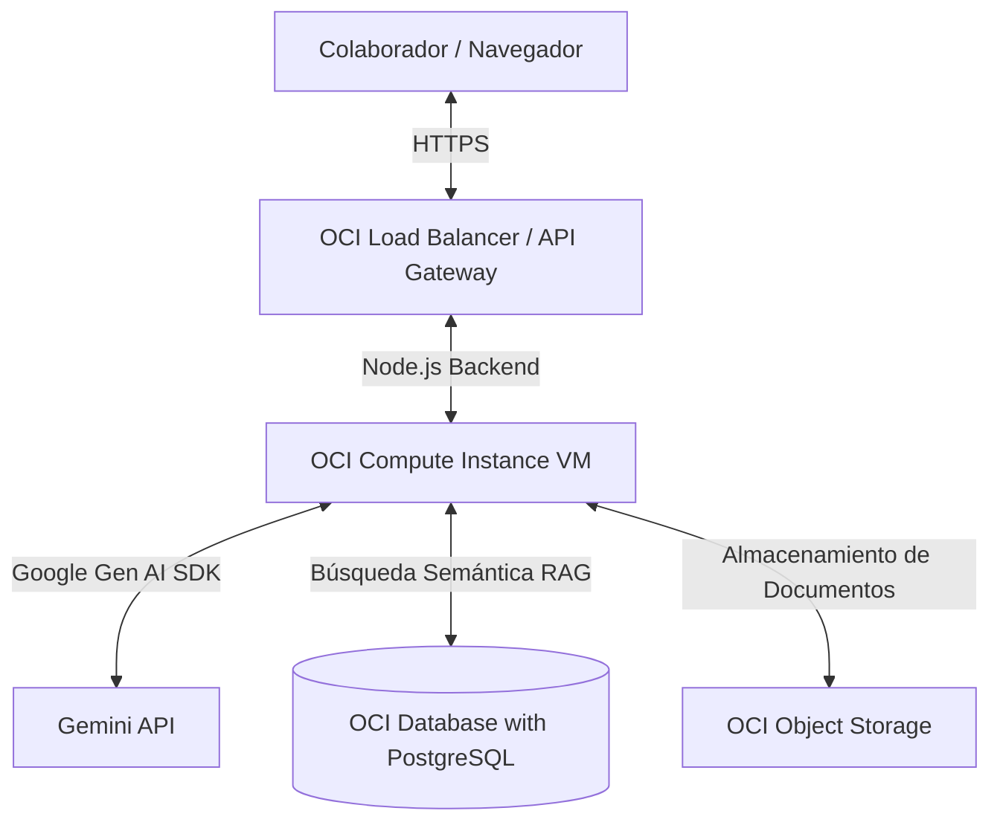

# Agente Alura: Ecosistema Corporativo de Onboarding y Mentoría 🤖📚

**Agente Alura** es un asistente cognitivo inteligente de nivel empresarial diseñado para interactuar con los colaboradores de una organización. Su objetivo principal es resolver dudas y consultas en tiempo real actuando como un mentor técnico con base en la documentación interna de la empresa.

---

## 🎯 Objetivo y Alcance del Proyecto

Desarrollar un agente de inteligencia artificial corporativo, accesible para todos los colaboradores de forma abierta, capaz de responder preguntas con base en documentos internos en múltiples formatos (desde guías de estilo y configuraciones de desarrollo hasta hojas de cálculo de módulos).

### 📄 Formatos de Archivos Soportados
El motor de ingesta del agente cuenta con lectores especializados para procesar:
- **Documentos de Texto**: PDF (`.pdf`), Word (`.docx`), Markdown (`.md`), HTML (`.html`).
- **Hojas de Cálculo y Estructuras**: Excel (`.xlsx`), CSV (`.csv`), JSON (`.json`).
- **Presentaciones**: PowerPoint (`.pptx`).

---

## ☁️ Arquitectura e Infraestructura de Nube (OCI)

Para cumplir con las especificaciones de despliegue del reto, el proyecto utiliza la nube de **Oracle Cloud Infrastructure (OCI)**:

### Servicios de OCI Utilizados:
1. **OCI Compute (Virtual Machine)**: Instancia de cómputo en la nube (Ubuntu/Oracle Linux) encargada de hospedar el backend en Node.js y servir la aplicación web de React.
2. **OCI Object Storage**: Repositorio de almacenamiento de objetos donde se cargan y guardan los archivos originales (PDF, Word, CSV, etc.) subidos por la empresa, sirviendo como el "Data Lake" de conocimientos del agente.
3. **OCI PostgreSQL (Base de Datos)**: Base de datos relacional administrada para almacenar usuarios, sesiones de chat e indexar embeddings vectoriales mediante la extensión `pgvector`.

---

## 🤖 Capacidades Clave del Agente (Reglamento Operativo)

1. **Tutor de Programación e Integración (Onboarding)**:
   - Explicar arquitecturas de código complejas y guiar de forma socrática a los nuevos programadores.
   - Evaluar código proporcionado de forma constructiva sin resolverlo directamente.
2. **Consultor RAG Multiformato**:
   - Extraer y vectorizar información de archivos PDF, Excel, Word, etc., cargados en OCI Object Storage.
   - Generar respuestas detalladas citando explícitamente el nombre del archivo y la sección de donde se obtuvo la respuesta.
3. **Sandbox y Herramientas (Function Calling)**:
   - Integración segura con Google Search para corroborar sintaxis de APIs.

---

## 📁 Estructura del Repositorio

* **`.agents/`**: Reglas de desarrollo e importación de habilidades para el asistente de IA.
* **`google-skills/`**: Habilidades clonadas de Google como soporte de procesamiento e infraestructura.
* **`knowledge-base/`**: Documentación cargada por defecto para simular el onboarding técnico:
  - [`configuracion_entorno.md`](file:///c:/Users/NeoUniverse/Agente-Alura/knowledge-base/configuracion_entorno.md): Manual paso a paso de desarrollo local.
  - [`guia_estilo.md`](file:///c:/Users/NeoUniverse/Agente-Alura/knowledge-base/guia_estilo.md): Guías de TypeScript, Git, Commits y Vanilla CSS.
  - [`mapa_modulos.csv`](file:///c:/Users/NeoUniverse/Agente-Alura/knowledge-base/mapa_modulos.csv): Base de datos en formato CSV de la arquitectura de la aplicación.
