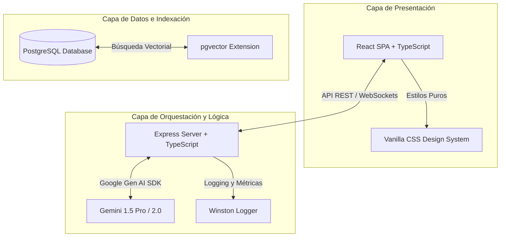

# Agente Alura: Plataforma de Mentoría y Onboarding Inteligente 🤖📚

**Agente Alura** es un ecosistema cognitivo de nivel empresarial diseñado para integrarse con la plataforma educativa Alura. Su propósito principal es actuar como un mentor y tutor interactivo para desarrolladores junior y estudiantes, guiándolos durante su proceso de aprendizaje y sus primeras contribuciones en el código.

A través de capacidades de procesamiento de lenguaje natural de última generación, recuperación semántica de datos (RAG) y ejecución segura de herramientas, el Agente Alura simula la interacción con un desarrollador líder o tutor socrático para guiar a los usuarios hacia el éxito sin darles directamente las respuestas.

---

## 🎯 Misión y Visión del Proyecto

### Misión
Acelerar la curva de aprendizaje de los programadores junior y estudiantes mediante una mentoría personalizada e interactiva disponible 24/7, garantizando que entiendan la arquitectura del software, sigan las mejores prácticas y aprendan a depurar problemas de forma autónoma.

### Visión
Convertirse en el estándar de mentoría digital para plataformas educativas de programación, donde la inteligencia artificial asista no solo en la resolución de dudas teóricas, sino en la validación práctica de código y la recomendación predictiva de trayectorias de carrera tecnológica.

---

## 🛠️ Capacidades Clave del Agente (Reglamento Operativo)

De acuerdo con las directrices académicas e institucionales de Alura, el agente debe operar bajo los siguientes cuatro pilares funcionales:

### 1. Tutor de Programación Interactivo (Método Socrático)
* **Desglose de Conceptos Complejos**: Explicar conceptos de software abstractos (inyección de dependencias, concurrencia, normalización de bases de datos, closures, etc.) usando analogías y ejemplos visuales adaptados al nivel del usuario.
* **Evaluación de Código Estructural**: Analizar fragmentos de código proporcionados por el estudiante para identificar errores de sintaxis, cuellos de botella de rendimiento y malas prácticas.
* **Guía en lugar de Respuestas**: En lugar de reescribir el código corregido para el estudiante, el agente señala el error lógico y hace preguntas guía para que el estudiante aprenda a resolver el problema por sí mismo.
* **Generación de Retos Técnicos**: Crear ejercicios prácticos personalizados de código basados en el tema que el alumno está estudiando actualmente.

### 2. Recomendador Dinámico de Rutas de Aprendizaje
* **Análisis de Perfil Cognitivo**: Analizar de manera inteligente el historial de cursos completados por el alumno, su tiempo promedio de estudio y el área tecnológica de su interés (Frontend, Backend, Cloud, Data Science).
* **Predicción de Trayectoria de Carrera**: Recomendar los siguientes pasos específicos dentro del catálogo de cursos de Alura para ayudar al estudiante a alcanzar sus metas profesionales.

### 3. Compañero de Consultas y RAG (Retrieval-Augmented Generation)
* **Búsqueda Semántica Local**: Acceder a una base de conocimientos vectorizada que contiene transcripciones de clases, artículos técnicos oficiales de Alura y preguntas recurrentes del foro comunitario.
* **Trazabilidad de Fuentes**: Cada respuesta académica dada por el agente debe incluir la clase, video o artículo específico de Alura de donde se extrajo la información, asegurando transparencia y confianza.

### 4. Sandbox de Ejecución y Herramientas (Function Calling)
* **Búsqueda Web Segura**: Realizar consultas filtradas mediante APIs de búsqueda (ej. Google Search) únicamente para recuperar documentación oficial y actualizada sobre librerías o frameworks (ej. MDN, npm, PyPI).
* **Compilación y Validación Interactiva**: Ejecutar pequeñas piezas de código de forma aislada y segura para demostrar comportamientos lógicos al usuario.

---

## 🚀 Arquitectura Detallada del Sistema

El Agente Alura se compone de una arquitectura desacoplada de tres capas de nivel empresarial:

### 1. Capa de Presentación (Frontend)
Construida en **React con Vite y TypeScript** para asegurar un rendimiento de renderizado instantáneo. Los componentes visuales (ventanas de chat, burbujas de mensajes, bloques de código interactivos) se estilizan exclusivamente con **Vanilla CSS**, garantizando transiciones suaves, soporte de tema oscuro de alta calidad y un diseño responsivo adaptado a dispositivos móviles y de escritorio.

### 2. Capa de Orquestación y Lógica (Backend)
Servidor basado en **Node.js y Express (TypeScript)** que administra el flujo de conversación, la persistencia de las sesiones y la inicialización de herramientas. La comunicación con la IA se realiza de manera nativa mediante el **Google Gen AI SDK (`@google/genai`)**, lo que permite:
* Integrar historial conversacional mediante estructuras de memoria a corto plazo.
* Ejecutar llamadas a funciones (*Function Calling*) estructuradas.
* Realizar consultas semánticas precisas.

### 3. Capa de Persistencia e Indexación (Datos)
Motor de base de datos **PostgreSQL** con la extensión **`pgvector`**. Esta base almacena el historial persistente de conversaciones de los alumnos, sus perfiles y las representaciones vectoriales (embeddings de 1536 dimensiones) de los documentos de conocimiento del proyecto.

---

## 📁 Organización del Repositorio

A continuación se detalla la estructura física de directorios del proyecto:

* **`.agents/`**: Directorio de personalización del agente.
  - [`AGENTS.md`](file:///c:/Users/NeoUniverse/Agente-Alura/.agents/AGENTS.md): Reglas de desarrollo y restricciones tecnológicas para el asistente de IA.
  - [`skills.json`](file:///c:/Users/NeoUniverse/Agente-Alura/.agents/skills.json): Configuración de importación de habilidades de desarrollo.
* **`google-skills/`**: Habilidades y guías técnicas clonadas del repositorio oficial de Google como soporte de procesamiento e infraestructura en la nube.
* **`knowledge-base/`**: Base de conocimientos utilizada por el motor RAG del agente.
  - [`configuracion_entorno.md`](file:///c:/Users/NeoUniverse/Agente-Alura/knowledge-base/configuracion_entorno.md): Manual paso a paso para desplegar el proyecto localmente.
  - [`guia_estilo.md`](file:///c:/Users/NeoUniverse/Agente-Alura/knowledge-base/guia_estilo.md): Normas de desarrollo, TypeScript, Conventional Commits y UI/UX.
  - [`mapa_modulos.csv`](file:///c:/Users/NeoUniverse/Agente-Alura/knowledge-base/mapa_modulos.csv): Mapa tabular con las responsabilidades del código y sus respectivos tests.
* **`.gitignore`**: Configuración de exclusiones del sistema, dependencias de Node.js e IDEs.
