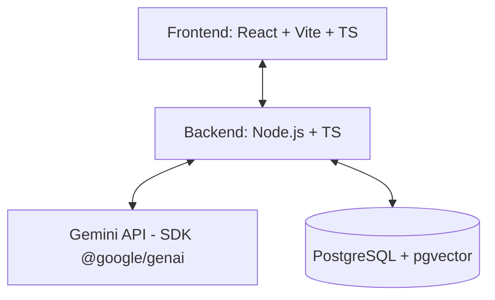

# Agente Alura 🤖📚

**Agente Alura** es un asistente cognitivo inteligente diseñado para integrarse con la plataforma educativa Alura, con el fin de guiar, motivar y resolver dudas de los estudiantes en tiempo real.

---

## 🎯 ¿Qué debe hacer el Agente? (Instrucciones del Proyecto)

De acuerdo con los objetivos del proyecto, el agente debe ser capaz de desempeñar las siguientes **capacidades y funciones clave**:

### 1. Tutor de Programación Interactivo
* **Explicación de Conceptos**: Explicar de manera clara y didáctica conceptos técnicos complejos (desde bases de programación hasta desarrollo avanzado).
* **Evaluación de Código**: Evaluar las soluciones de código propuestas por los alumnos de forma constructiva, identificando áreas de mejora sin entregar la respuesta directa.
* **Propuesta de Retos**: Diseñar retos y ejercicios prácticos adaptados al nivel del estudiante para reforzar el aprendizaje de manera interactiva.

### 2. Recomendador de Rutas
* **Análisis de Perfil**: Estudiar el perfil del alumno, su progreso actual en la plataforma y sus intereses profesionales.
* **Sugerencia de Aprendizaje**: Aconsejar de forma inteligente los siguientes cursos, especializaciones y contenidos educativos más adecuados para su crecimiento.

### 3. Compañero de Consultas (RAG)
* **Búsqueda Semántica**: Responder preguntas específicas sobre los cursos y el funcionamiento de la plataforma.
* **Bases de Información**: Recuperar información contextualizada directamente desde las transcripciones de las clases, documentación de Alura y preguntas frecuentes del foro.

### 4. Sandbox / Ejecución de Herramientas
* **Búsqueda Externa (Google Search)**: Consultar internet de forma segura para obtener documentación técnica actualizada.
* **Validación de Código**: Probar y validar la sintaxis o estructura de pequeños fragmentos de código de forma interactiva utilizando capacidades de ejecución segura (*Function Calling*).

---

## 🛠️ Pila Tecnológica del Proyecto

Para la construcción del Agente Alura, se ha definido la siguiente arquitectura y pila tecnológica recomendada:

* **Frontend**:
  - **Framework**: **React + Vite (TypeScript)** para una interfaz de usuario modular y de carga ultrarrápida.
  - **Estilado**: **Vanilla CSS personalizado** (variables CSS, modo oscuro integrado, layouts fluidos y micro-animaciones fluidas de chat) para un control estético absoluto sin dependencias adicionales.
* **Backend**:
  - **Entorno**: **Node.js con TypeScript** (utilizando **Express** o **Fastify**) para la API, la memoria conversacional y la orquestación de herramientas.
* **Integración de IA (LLM)**:
  - **SDK**: **Google Gen AI SDK (`@google/genai`)** para la comunicación directa y optimizada con modelos avanzados de Gemini (como Gemini 1.5 Pro/Flash o Gemini 2.0).
* **Almacenamiento e Indexación**:
  - **Base de Datos**: **PostgreSQL con la extensión `pgvector`** para el almacenamiento de sesiones, perfiles de usuario y búsqueda vectorial (embeddings) para el sistema de RAG.

---

## ⚙️ Estructura del Repositorio

* **`.agents/`**: Configuración de personalización e instrucciones de comportamiento para el asistente de IA durante el desarrollo.
* **`google-skills/`**: Repositorio de referencia técnica para habilitar herramientas en la nube, APIs y configuraciones del entorno de procesamiento.
