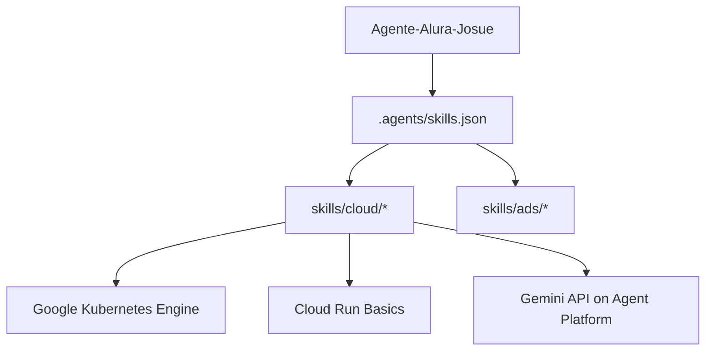

# Agente Alura 🤖✨

Un entorno de desarrollo inteligente optimizado con habilidades personalizadas para productos de Google y automatización.

---

## 🚀 Arquitectura del Proyecto

Este espacio de trabajo cuenta con una integración avanzada de **habilidades del agente (Agent Skills)** basadas en las especificaciones oficiales de Google para su uso directo por el asistente.

---

## 🛠️ Estructura del Repositorio

- **`google-skills/`**: Copia local del repositorio oficial de habilidades de Google ([google/skills](https://github.com/google/skills)).
- **`.agents/`**: Configuración de personalización para el agente de IA, registrando dinámicamente las habilidades como base de pensamiento y resolución de problemas.
- **`.gitignore`**: Exclusiones de archivos del sistema e IDE para mantener el repositorio limpio.

---

## 📖 Habilidades Integradas

El agente cuenta con conocimiento experto y guías de comandos para:
- **GenAI / Agent Platform**: Gemini API, Gemini Interactions, RAG Engine, Skill Registry.
- **Bases de Datos & Data**: AlloyDB, BigQuery, Bigtable, Cloud SQL.
- **Cómputo & Serverless**: Cloud Run, Kubernetes Engine (GKE) en toda su extensión (redes, costos, escalado, seguridad).
- **Publicidad & Integración**: Google Ads API, Google Mobile Ads SDK, Interactive Media Ads (IMA).

> [!TIP]
> Cualquier habilidad agregada dentro de la carpeta `.agents/` o registrada en `skills.json` será asimilada de forma automática por el asistente en las próximas interacciones.
