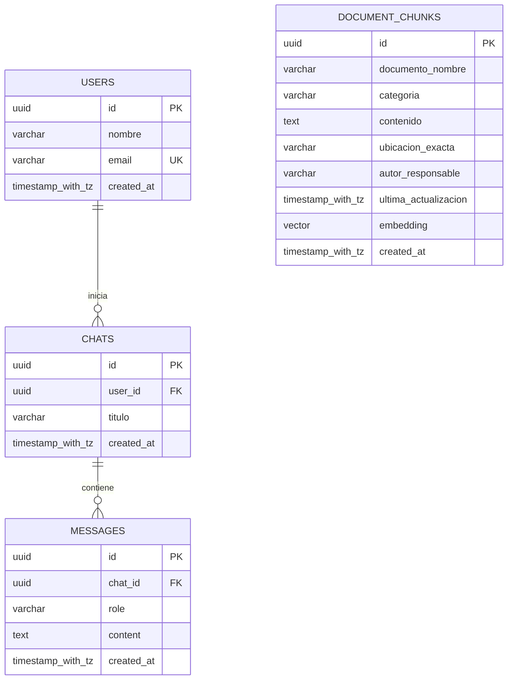
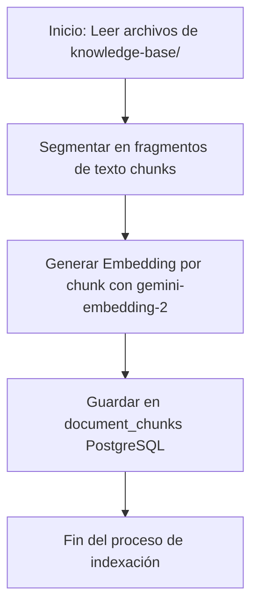
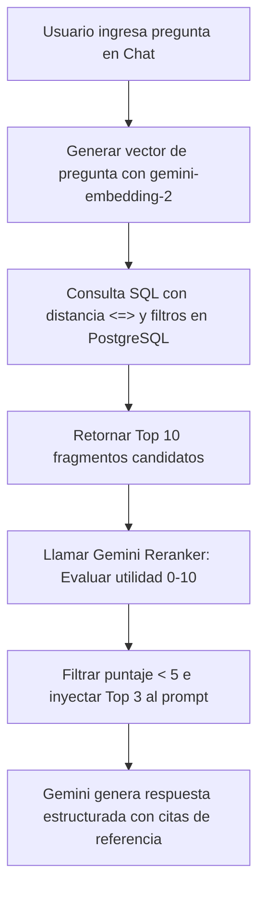

# Manual de Base de Datos y Esquema Vectorial — Neouniverse 🗄️📐

Este manual proporciona una especificación técnica detallada de la arquitectura de persistencia de datos, esquemas relacionales, indexación de embeddings y operaciones vectoriales del **Agente Alura** en **Neouniverse**. 

---

## 🏗️ 1. Arquitectura de Datos e Infraestructura

El sistema de datos del Agente Alura está diseñado para operar en entornos híbridos y de contingencia, lo que permite pasar de un ambiente local simulado a producción en la nube sin requerir cambios de código.

```
                  ┌───────────────────────────────────────┐
                  │             Capa de Datos             │
                  └───────────────────┬───────────────────┘
                                      │
                   ¿DATABASE_URL configurada y activa?
                                      │
                     ┌────────────────┴────────────────┐
                     Sí                                No
                     ▼                                 ▼
         ┌───────────────────────┐         ┌───────────────────────┐
         │ PostgreSQL + pgvector │         │       Modo Mock       │
         │ (Producción en OCI /  │         │  (Memoria y archivos  │
         │    Docker local)      │         │   JSON en logs/)      │
         └───────────────────────┘         └───────────────────────┘
```

### A. Persistencia en Producción (PostgreSQL + pgvector)
En producción, el agente se conecta a una instancia administrada de **OCI Database with PostgreSQL** o a un contenedor local en Docker. 
- **Extensión Vectorial**: Se habilita la extensión `pgvector` en la base de datos para almacenar y realizar operaciones algebraicas sobre embeddings.
- **Pool de Conexiones**: El cliente (`client.py`) gestiona las conexiones mediante un `ThreadedConnectionPool` con capacidades de limpieza automática de parámetros (por ejemplo, remoción de la opción `schema=public` que es incompatible con algunos controladores nativos de PostgreSQL en Python).

### B. Sistema de Contingencia (Modo Mock)
Si no se provee la variable `DATABASE_URL` o no se puede establecer conexión en un plazo de tiempo, el sistema activa automáticamente el **Modo Mock**.
- **Historial y Usuarios**: Se almacenan temporalmente en memoria en la estructura `mock_database` en `client.py`.
- **Vector Store de Documentos**: Se simula cargando y leyendo un archivo de caché JSON local ubicado en `logs/mock_db_vector_store.json`.
- **Búsqueda Semántica**: Se realiza mediante coincidencia de palabras clave y ordenamiento heurístico.

---

## 🗃️ 2. Diccionario de Datos Relacional

La base de datos relacional consta de 4 tablas principales diseñadas para registrar el ciclo de vida del chat del usuario y los fragmentos indexados de la base de conocimientos.

### Diagrama Entidad-Relación (ER)



### A. Tabla: `users`
Almacena el perfil de los colaboradores y estudiantes que interactúan con el agente.

| Campo | Tipo de Datos | Restricciones | Descripción |
| :--- | :--- | :--- | :--- |
| `id` | `UUID` | `PRIMARY KEY`, `DEFAULT gen_random_uuid()` | Identificador único de usuario. |
| `nombre` | `VARCHAR(100)` | `NOT NULL` | Nombre completo del colaborador. |
| `email` | `VARCHAR(150)` | `UNIQUE`, `NOT NULL` | Correo electrónico corporativo o personal del usuario. |
| `created_at` | `TIMESTAMP WITH TZ` | `DEFAULT CURRENT_TIMESTAMP` | Fecha y hora de registro del usuario con zona horaria. |

### B. Tabla: `chats`
Define las sesiones de conversación abiertas por los usuarios.

| Campo | Tipo de Datos | Restricciones | Descripción |
| :--- | :--- | :--- | :--- |
| `id` | `UUID` | `PRIMARY KEY`, `DEFAULT gen_random_uuid()` | Identificador único de la sesión de chat. |
| `user_id` | `UUID` | `FOREIGN KEY`, `REFERENCES users(id) ON DELETE CASCADE` | Enlace al usuario creador del chat. Borrado en cascada. |
| `titulo` | `VARCHAR(200)` | `DEFAULT 'Nueva Conversación'` | Título de la sesión (puede autogenerarse según el tema inicial). |
| `created_at` | `TIMESTAMP WITH TZ` | `DEFAULT CURRENT_TIMESTAMP` | Fecha y hora en que se creó la sesión. |

### C. Tabla: `messages`
Almacena cada mensaje enviado dentro de un chat, tanto del emisor humano como del modelo de IA.

| Campo | Tipo de Datos | Restricciones | Descripción |
| :--- | :--- | :--- | :--- |
| `id` | `UUID` | `PRIMARY KEY`, `DEFAULT gen_random_uuid()` | Identificador único de mensaje. |
| `chat_id` | `UUID` | `FOREIGN KEY`, `REFERENCES chats(id) ON DELETE CASCADE` | Enlace al chat correspondiente. Borrado en cascada. |
| `role` | `VARCHAR(20)` | `NOT NULL` | Rol de quien envía el mensaje. Valores aceptados: `'user'`, `'model'`. |
| `content` | `TEXT` | `NOT NULL` | Texto completo del mensaje. |
| `created_at` | `TIMESTAMP WITH TZ` | `DEFAULT CURRENT_TIMESTAMP` | Fecha y hora exacta de la transmisión del mensaje. |

### D. Tabla: `document_chunks`
Tabla fundamental para el motor RAG. Almacena fragmentos específicos de documentos internos y sus embeddings.

| Campo | Tipo de Datos | Restricciones | Descripción |
| :--- | :--- | :--- | :--- |
| `id` | `UUID` | `PRIMARY KEY`, `DEFAULT gen_random_uuid()` | Identificador del fragmento indexado. |
| `documento_nombre` | `VARCHAR(150)` | `NOT NULL` | Nombre del archivo de origen (ejemplo: `Guia_Oficial_de_Ingenieria_Backend__Neouniverse.md`). |
| `categoria` | `VARCHAR(50)` | `NOT NULL` | Filtro de clasificación (ejemplo: `Entorno`, `Estilo`, `Arquitectura`). |
| `contenido` | `TEXT` | `NOT NULL` | Texto plano del fragmento segmentado del documento original. |
| `ubicacion_exacta` | `VARCHAR(150)` | `NULL` | Ubicación dentro del archivo (ejemplo: `Líneas 10-34`, `Diapositiva 5`). |
| `autor_responsable` | `VARCHAR(150)` | `NULL` | Propietario del documento para escalamientos de dudas (ejemplo: `DevOps Lead`). |
| `ultima_actualizacion`| `TIMESTAMP WITH TZ` | `NULL` | Fecha de última modificación registrada en el sistema de archivos del documento original. |
| `embedding` | `VECTOR(1536)` | `NULL` | Representación matemática en espacio vectorial de 1536 dimensiones. |
| `created_at` | `TIMESTAMP WITH TZ` | `DEFAULT CURRENT_TIMESTAMP` | Fecha y hora de ingesta de este chunk en la base de datos. |

---

## 📐 3. Esquema Vectorial y Motor RAG

La búsqueda vectorial permite encontrar fragmentos semánticamente relevantes aun cuando las palabras del colaborador no coincidan literalmente con la documentación.

### A. Generación de Embeddings
- **Modelo Utilizado**: `gemini-embedding-2` de Google Gen AI.
- **Dimensión**: $1536$ dimensiones (tipo coma flotante).
- **Parámetro del SDK**: `task_type="RETRIEVAL_QUERY"` para consultas del chat y `task_type="RETRIEVAL_DOCUMENT"` para los fragmentos de la base de datos durante la ingesta.

### B. Métrica de Distancia Vectorial
Se utiliza la **Distancia de Coseno** (`<=>` en pgvector) debido a que es inmune a las variaciones en la longitud de los textos. 
La fórmula empleada para calcular la similitud semántica final es:

$$\text{Similitud de Coseno} = 1 - (\vec{A} \cdot \vec{B}) / (||\vec{A}|| \cdot ||\vec{B}||) = 1 - (\text{embedding} \Leftrightarrow \text{query\_vector})$$

En PostgreSQL, esto se expresa como:
```sql
1 - (embedding <=> query_vector) AS similitud
```
Una similitud cercana a `1.0` representa alta cercanía semántica; valores cercanos a `0.0` o inferiores indican baja correlación.

### C. Estrategia de Reranking
Para asegurar que el agente reciba información con la más alta calidad y especificidad:
1. **Recuperación inicial**: La consulta vectorial extrae los mejores $N$ candidatos ($N = 10$).
2. **Evaluación con LLM**: Los fragmentos son procesados por el modelo generativo de Gemini mediante un esquema JSON estructurado (`RerankResult`), asignando una calificación de `0` a `10` a cada uno.
3. **Filtro y Límite**: Se eliminan fragmentos con calificación menor a `5` y se eligen los mejores $K$ fragmentos ($K = 3$) para ensamblar el bloque de contexto del prompt final.

---

## ⚡ 4. Optimización de Indexación y Rendimiento

Debido a que el volumen de documentos corporativos puede incrementarse, se definieron estrategias de indexación híbrida.

### A. Índice Vectorial HNSW (Hierarchical Navigable Small World)
En lugar de comparar linealmente el vector de búsqueda contra cada fila (búsqueda secuencial), se construye un grafo multicapa de vecinos cercanos para lograr búsquedas aproximadas veloces (tiempo de respuesta logarítmico).

```sql
CREATE INDEX IF NOT EXISTS document_chunks_hnsw_idx 
ON document_chunks USING hnsw (embedding vector_cosine_ops);
```
- **Clase de Operadores**: `vector_cosine_ops` le indica al índice que las búsquedas se realizarán empleando distancia de coseno.

### B. Índices B-Tree Tradicionales
Para permitir búsquedas combinadas eficientes donde se aplica un filtro estructurado (como filtrar documentos por categoría antes de computar similitudes vectoriales), existen los siguientes índices relacionales:

```sql
CREATE INDEX IF NOT EXISTS document_chunks_categoria_idx ON document_chunks (categoria);
CREATE INDEX IF NOT EXISTS document_chunks_documento_nombre_idx ON document_chunks (documento_nombre);
CREATE INDEX IF NOT EXISTS document_chunks_autor_responsable_idx ON document_chunks (autor_responsable);
```

---

## 📝 5. Ejemplos de Consultas SQL Prácticas

### A. Búsqueda Vectorial RAG (con Filtro de Categoría)
Esta es la consulta que ejecuta el `retrieval_engine.py` para encontrar los fragmentos que darán respuesta al usuario:

```sql
SELECT 
    id, 
    documento_nombre, 
    categoria, 
    contenido, 
    ubicacion_exacta, 
    autor_responsable, 
    ultima_actualizacion,
    1 - (embedding <=> %s) AS similitud
FROM document_chunks
WHERE categoria = %s
ORDER BY embedding <=> %s
LIMIT %s;
```
*(Los marcadores `%s` se rellenan con el string del vector de consulta, la categoría elegida, el vector de consulta nuevamente, y el límite máximo de candidatos).*

### B. Insertar y Actualizar Mensajes de Conversación
Guarda los diálogos del asistente y el colaborador para preservar la memoria conversacional de turnos anteriores:

```sql
-- Insertar un nuevo mensaje
INSERT INTO messages (chat_id, role, content)
VALUES ('7b120cda-8a19-482a-a035-9005085e5138', 'user', '¿Cómo configuro Docker en OCI?');

-- Consultar el historial completo de un chat ordenado cronológicamente
SELECT role, content, created_at 
FROM messages 
WHERE chat_id = '7b120cda-8a19-482a-a035-9005085e5138'
ORDER BY created_at ASC;
```

---

## 🔄 6. Flujo de Vida del Conocimiento (Ingesta y Búsqueda)

### Ingesta de Archivos e Indexación de Embeddings


### Recuperación Semántica (RAG) en Tiempo de Respuesta


---

## 🛠️ 7. Administración, Migración y Mantenimiento

### A. Ejecutar Migraciones del Esquema
Las migraciones se definen en `agente-alura/db/schema.sql` y se orquestan en Python desde `agente-alura/db/migrate.py`:
```bash
# Ejecutar desde la raíz del proyecto para estructurar las tablas e índices
python agente-alura/db/migrate.py
```

### B. Poblar / Sembrar la Base de Conocimientos (Seeding)
La base de conocimientos local se procesa, vectoriza e introduce a la base de datos usando el cargador automático de semillas:
```bash
# Script dedicado que parsea los .md y .csv e inicializa la tabla document_chunks
python agente-alura/agent/ingestion_service.py
```
*(Nota: El servicio de ingesta realiza un borrado previo (`DELETE FROM document_chunks;`) para evitar duplicaciones al re-indexar los archivos locales).*
